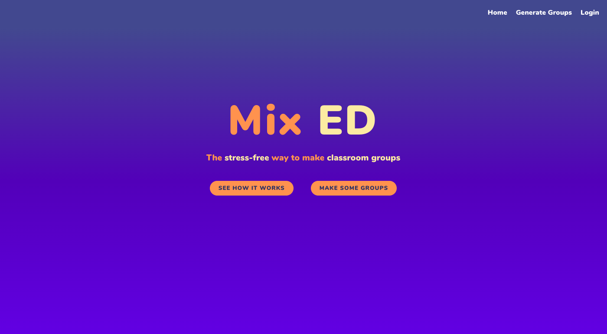
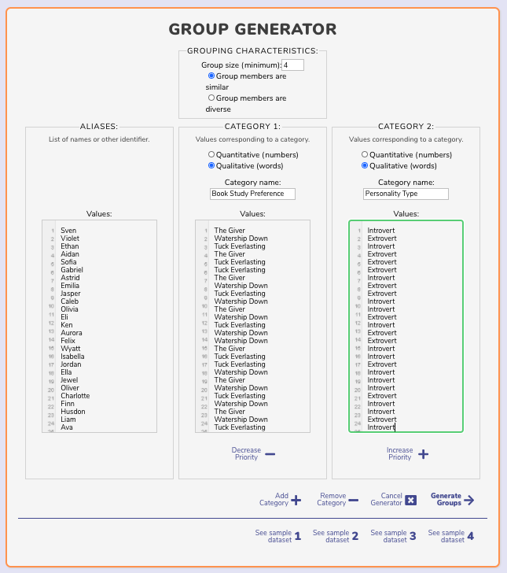
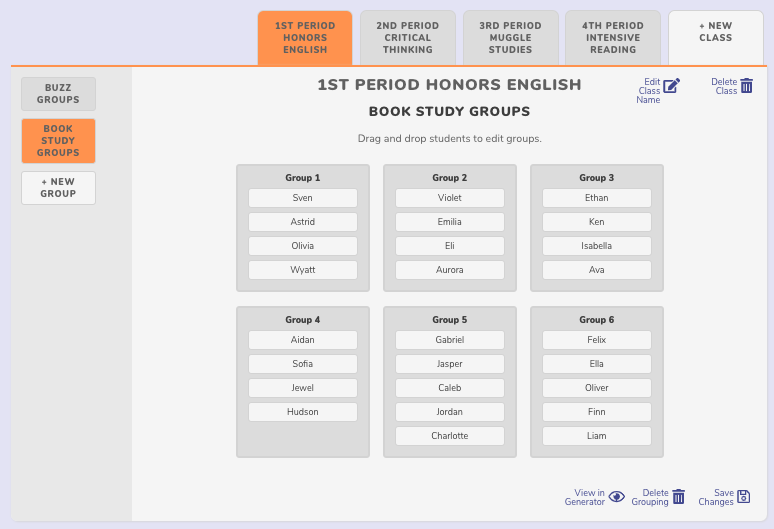

# Mix Ed takes the headache out of forming groups in the classroom.

[Mix Ed](https://mixed-app.vercel.app/) is a group generator app that allows teachers to create homogeneous or heterogeneous student groups based on student data. Teachers input students' names (or other identifier, such as a number) and decide what kinds of categories they'd like to form groups based upon (for instance, test scores, personality type, topic of interest, or favorite book), then provide a value for each student within that category. Then, teachers can decide on group size and whether students within each group should be similar or whether they should be different from each other, and click generate. Generated groupings can be saved according to class for easy access or editing later on.

See Mix Ed in action here: <https://mixed-app.vercel.app/>

## Features
- Generate groups
- Rearrange groups
- Save generated groups

## Demo user login

To try the app out, the demo consumer login can be used as follows:

username: msmith
password: password

## Screenshots

## Built with
- [Create React App](https://github.com/facebook/create-react-app)
- [React-Router](https://reacttraining.com/react-router/)
- CSS

## API
See the Mix Ed API at <https://github.com/rise-erpelding/mixed-api>